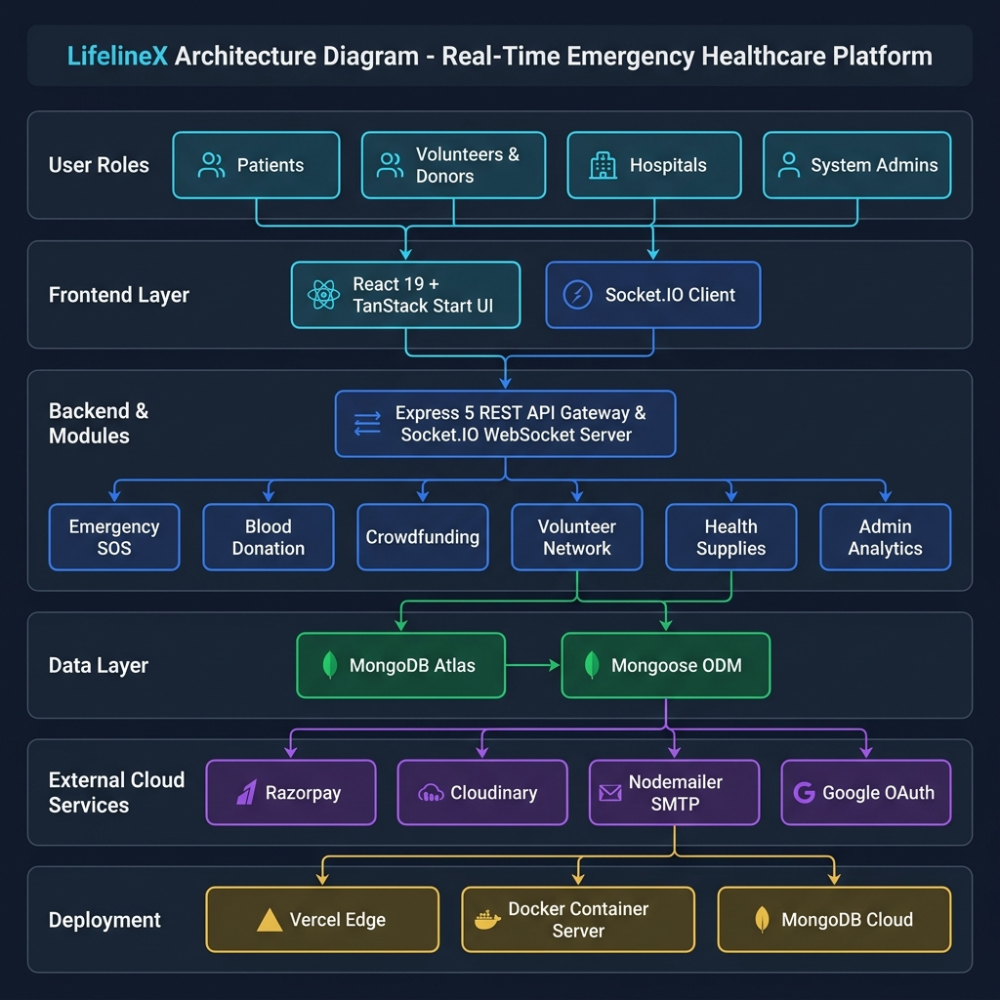

# LifelineX System Architecture Diagram

**Project Name:** LifelineX  
**One-Line Purpose:** An AI-powered, real-time emergency healthcare platform connecting patients, volunteers, blood donors, and hospitals with rapid SOS dispatch and medical crowdfunding.

---

## 🎨 System Architecture Graphic



---

## 🏗️ Interactive Mermaid Diagram

```mermaid
graph TD
    %% Styling Classes
    classDef roleStyle fill:#1e293b,stroke:#3b82f6,stroke-width:2px,color:#f8fafc;
    classDef feStyle fill:#0f172a,stroke:#06b6d4,stroke-width:2px,color:#f8fafc;
    classDef beStyle fill:#1e1b4b,stroke:#8b5cf6,stroke-width:2px,color:#f8fafc;
    classDef moduleStyle fill:#172554,stroke:#3b82f6,stroke-width:1.5px,color:#f8fafc;
    classDef dbStyle fill:#022c22,stroke:#10b981,stroke-width:2px,color:#f8fafc;
    classDef extStyle fill:#312e81,stroke:#a855f7,stroke-width:1.5px,color:#f8fafc;
    classDef deployStyle fill:#451a03,stroke:#f59e0b,stroke-width:1.5px,color:#f8fafc;

    %% Layer 1: User Roles
    subgraph L1 ["👥 1. User Roles"]
        Patients["🤒 Patients & Seekers<br/>(Request SOS & Blood)"] :::roleStyle
        Volunteers["🚑 Volunteers & Donors<br/>(Respond to Emergency)"] :::roleStyle
        Hospitals["🏥 Hospitals & Clinics<br/>(Manage Beds & Inventory)"] :::roleStyle
        Admins["🛡️ System Administrators<br/>(Verify & Monitor)"] :::roleStyle
    end

    %% Layer 2: Frontend
    subgraph L2 ["💻 2. Frontend Layer (Presentation)"]
        UIApp["React 19 + TanStack Start App<br/>(SSR, Router, Tailwind CSS, Recharts)"] :::feStyle
        SocketClient["Socket.IO Client<br/>(Real-time Tracking)"] :::feStyle
    end

    %% Layer 3: Backend API & Services
    subgraph L3 ["⚡ 3. Backend Layer (Application Logic)"]
        Gateway["Express 5 REST API Gateway<br/>(Auth, Helmet, Rate Limiter)"] :::beStyle
        SocketServer["Socket.IO WebSocket Server<br/>(Live Location & Dispatch Engine)"] :::beStyle
        
        %% Major Business Modules
        subgraph Modules ["🧩 Major Business Modules"]
            SOSModule["🚨 Emergency & SOS<br/>(Dispatch & Tracking)"] :::moduleStyle
            BloodModule["🩸 Blood Donation<br/>(Donor Matching)"] :::moduleStyle
            FundModule["💳 Crowdfunding<br/>(Medical Campaigns)"] :::moduleStyle
            VolModule["🤝 Volunteer Network<br/>(Verification Queue)"] :::moduleStyle
            HealthModule["💊 Healthcare & Supplies<br/>(Medicines & Schemes)"] :::moduleStyle
            AdminModule["📊 Admin & Analytics<br/>(Verification & Logs)"] :::moduleStyle
        end
    end

    %% Layer 4: Database & Storage
    subgraph L4 ["🗄️ 4. Data Layer (Persistence)"]
        MongoDB[("🍃 MongoDB Atlas<br/>(User, Emergency, Blood, Payment Data)")] :::dbStyle
        Mongoose["Mongoose ODM<br/>(Schema & Indexing)"] :::dbStyle
    end

    %% Layer 5: External Services
    subgraph L5 ["☁️ 5. External Services"]
        Razorpay["💳 Razorpay<br/>(Payment Gateway)"] :::extStyle
        Cloudinary["🖼️ Cloudinary<br/>(Document CDN)"] :::extStyle
        Nodemailer["✉️ SMTP / Nodemailer<br/>(Email & OTP Alerts)"] :::extStyle
        OAuth["🔐 Google OAuth 2.0<br/>(Social Authentication)"] :::extStyle
    end

    %% Layer 6: Deployment
    subgraph L6 ["🚀 6. Deployment & Infrastructure"]
        Vercel["⚡ Vercel / Netlify<br/>(Frontend Edge Hosting)"] :::deployStyle
        CloudServer["🐳 Docker Container / Cloud App<br/>(Node.js Backend Hosting)"] :::deployStyle
        MongoCloud["☁️ MongoDB Atlas Cloud<br/>(Managed Multi-Region DB)"] :::deployStyle
    end

    %% Connections
    Patients --> UIApp
    Volunteers --> UIApp
    Hospitals --> UIApp
    Admins --> UIApp

    UIApp --> Gateway
    UIApp <--> SocketClient
    SocketClient <--> SocketServer

    Gateway --> SOSModule
    Gateway --> BloodModule
    Gateway --> FundModule
    Gateway --> VolModule
    Gateway --> HealthModule
    Gateway --> AdminModule

    SocketServer --> SOSModule

    SOSModule --> Mongoose
    BloodModule --> Mongoose
    FundModule --> Mongoose
    VolModule --> Mongoose
    HealthModule --> Mongoose
    AdminModule --> Mongoose

    Mongoose --> MongoDB

    FundModule --> Razorpay
    VolModule --> Cloudinary
    AdminModule --> Cloudinary
    Gateway --> OAuth
    Gateway --> Nodemailer

    UIApp -. Deploy .- Vercel
    Gateway -. Deploy .- CloudServer
    MongoDB -. Host .- MongoCloud
```

---

## ⚡ 30-Second Architecture Overview

| Component | Technology / Role | Short Purpose Label |
| :--- | :--- | :--- |
| **Project Name** | **LifelineX** | Real-time Emergency Healthcare & Resource Dispatch Platform |
| **User Roles** | Patients, Volunteers/Donors, Hospitals, Admins | Access emergency SOS, respond to calls, manage inventory, and verify platform operations. |
| **Frontend** | React 19, TanStack Start & Router, Tailwind CSS | Responsive, highly-accessible UI with SSR and real-time live map interfaces. |
| **Backend** | Node.js, Express 5, Socket.IO WebSockets | REST API gateway handling business logic, user auth, rate-limiting, and live location web-sockets. |
| **Major Modules** | Emergency SOS, Blood Matching, Crowdfunding, Volunteer Verification, Health Supplies, Admin Analytics | Core healthcare functionalities isolated into clear service modules. |
| **Database** | MongoDB Atlas with Mongoose ODM | Document store for fast querying of geospatial emergency requests, user profiles, and logs. |
| **External Services** | Razorpay, Cloudinary, Nodemailer, Google OAuth | Handles payment processing, cloud document verification uploads, email notifications, and SSO. |
| **Deployment** | Vercel Edge (Frontend) + Docker/Cloud Node (Backend) + Atlas (DB) | Scalable, high-availability cloud deployment stack. |
